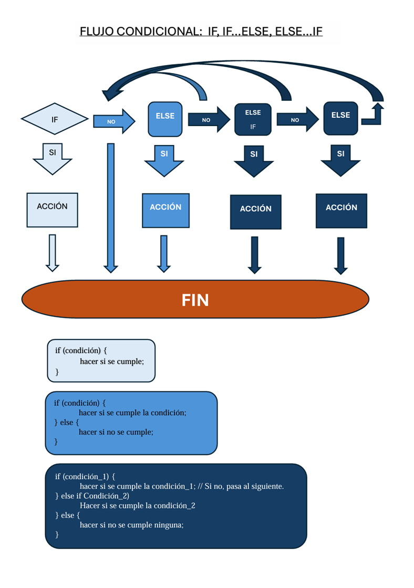

# ¿Qué es un condicional?

&#x20;Uno de los objetivos principales de la programación es crear códigos mediante los cuales las máquinas puedan realizar tareas de manera autónoma. Para lograr esto, es fundamental que los códigos sean dinámicos, es decir, que permitan a la máquina _"pensar"_ y tomar decisiones según las circunstancias. Este dinamismo se logra mediante la introducción de secuencias condicionales en el código.      &#x20;

&#x20;     Un condicional en **JavaScript** es una estructura de control que permite ejecutar bloques de código solo si se cumple una condición específica. Es fundamental para tomar decisiones en el código, haciendo que este sea dinámico y responda a diferentes situaciones. Los condicionales permiten valiar datos (por ejemplo, formularios), controlar flujos de programas (por ejemplo, menús de opciones), personalizar experiencias (por ejemplo, mostrar contenido según el usuario).

&#x20;     El código escrito casi se puede leer literalmente como si fuese una conversación normal. Esto facilita mucho su escritura y comprensión. Los condicionales permiten:

&#x20;     Las principales estructuras condiconales que se pueden escribir en **JavaScript** son las siguientes:      &#x20;

1.  `if` (El más básico): Evalúa una condición y ejecuta un bloque de código si es `true`.\\

    Su sintaxis básica es:

    ```
      if (condición) {
         hacer si se cumple;
      }
    ```

Por ejemplo:

```
  if (edad >= 18) {
    console.log("Eres mayor de edad");
  }
```

**El programa evalua si la varaible "edad" cumple la concición de ser igual o mayor que 18. Si se cumple, devuelve un mensaje de "Eres mayor de edad". Si no se cumple, el programa no hace nada.**

2.  if...else (Alternativa): Ejecuta un bloque si la condición es true y otro si es false. Es una evolución del anterior en la que ya aparece una segunda opción si la codición no se cumple. Su sintaxis básica es:

    ```
      if (condición) {
         hacer si se cumple la condición;
      } else {
         hacer si no se cumple;
      }
    ```

    Por ejemplo:

    ```
      if (edad >= 18) {
        console.log("Puedes votar");
      } else {
        console.log("No puedes votar");
      }
    ```

    **El programa evalua si la varaible "edad" cumple la concición de ser igual o mayor que 18. Si se cumple, devuelve un mensaje de "Puedes votar". Si no se cumple, el programa devuelve otro mensaje de "No puedes votar".**
3.  else if (Múltiples condiciones): Encadena condiciones para evaluar más de dos opciones. Su sintaxis básica es:

    ```
      if (condición_1) {
         hacer si se cumple la condición_1; // Si no, pasa al siguiente.
      } else if Condición_2)
         Hacer si se cumple la condición_2
      } else {
         hacer si no se cumple ninguna;
      }
    ```

Por ejemplo:

```
  if (nota >= 90) {
    console.log("A");
  } else if (nota >= 80) {
    console.log("B");
  } else {
    console.log("C");
  }
```

**El programa evalua si la variable "nota" cumple la condición de ser igual o mayor que 90. Si se cumple, devuelve un mensaje con la nota obtenida "A". Si no se cumple la condición anterior, pero es mayor o igual que 80 devuelve el mensaje "B". Si ninguna de las anteriores condiciones se cumplen, se devuelve el mensaje "C".**

<figure><figcaption></figcaption></figure>

4. switch (Para casos específicos):Es una forma de controlar el flujo del programa mediante la evaluación de una expresión y la ejecución de diferentes bloques de código según el valor de esa expresión. Es una alternativa más limpia y legible que usar múltiples if...else if...else cuando hay muchas condiciones posibles.

Su sintaxis básica es:

```
  switch (expresión) {
       case valor1:
         // Código a ejecutar si expresión === valor1
         break;
       case valor2:
         // Código a ejecutar si expresión === valor2
         break;
       // Puedes tener tantos 'case' como necesites
       default:
         // Código a ejecutar si ninguno de los casos anteriores coincide
     }
```

* `case` : Cada ´case`compara si el valor proporcionado es igual (===) al de la expresión evaluada en el`switch\`.
* `break`: Es crucial para evitar que el código siga ejecutando los casos siguientes. Si se omite, el programa continuará ejecutando los siguientes `case` hasta encontrar un `break` o hasta el final del `switch`.
* `default`: Es opcional y se ejecuta si ningún `case` coincide con la expresión. Es similar al `else` en un `if...else`.

Por ejemplo:

```
  let dia = 3;
  let nombreDia;

  switch (dia) {
    case 1:
      nombreDia = "Lunes";
      break;
    case 2:
      nombreDia = "Martes";
      break;
    case 3:
      nombreDia = "Miércoles";
      break;
    case 4:
      nombreDia = "Jueves";
      break;
    case 5:
      nombreDia = "Viernes";
      break;
    default:
      nombreDia = "Fin de semana";
  }

  console.log(nombreDia); // Resultado: "Miércoles"
```

**Declaramos una variable `dia` con valor `3` y Declaramos `nombreDia` (sin valor inicial).**

**Iniciamos el `switch` evaluando `dia`. Si `dia === 1` asigna "Lunes" a `nombreDia` y sale del switch; si `dia === 2` asigna "Martes" a `nombreDia` y sale del switch.....**

**`default:` Si no coincide con ningún `case` asigna `nombreDia` = "Fin de Semana" y termina este condicional.**

**Por último, Imprime el valor de `nombreDia`. en este caso se le ha asignado el `case 3` que es "Miércoles".**

5. Operador ternario (If-else en una línea): Condicional abreviado para asignaciones o retornos rápidos. (_**Se puede ver en el siguiente punto**_)

&#x20;     Cuando se usa un condicional, el programa compara valores o evalúa expresiones lógicas para determinar si una condición es verdadera (_**True**_) o falsa (_**False**_). En base a ese resultado, decide qué bloque de código ejecutar. En los codicionales se utilizan operadores de Asignación, Comparación y Lógicos:

| Operador | Nombre                                                                 | ¿Qué hace?                                                                 | Ejemplo               |
| -------- | ---------------------------------------------------------------------- | -------------------------------------------------------------------------- | --------------------- |
| =        | Asignación                                                             | Asigna un valor a una variable                                             | No es comparación     |
| ==       | Igualdad (no estricta)                                                 | Compara si los valores son iguales, aunque sean de distinto tipo           | Ej: '5' == 5 → true   |
| ===      | Igualdad estricta                                                      | Compara si los valores y los tipos son iguales                             | Ej: '5' === 5 → false |
| !=       | Desigualdad (no estricta)                                              | Compara si los valores son diferentes, sin importar el tipo                | Ej: '5' != 5 → false  |
| !==      | Desigualdad estricta Compara si los valores o los tipos son diferentes | Ej: '5' !== 5 → true                                                       |                       |
| >        | Mayor que                                                              | Verifica si el valor de la izquierda es mayor que el de la derecha         | Ej: 7 > 5 → true      |
| <        | Menor que                                                              | Verifica si el valor de la izquierda es menor que el de la derecha         | Ej: 7 < 5 → false     |
| >=       | Mayor o igual que                                                      | Verifica si el valor de la izquierda es mayor o igual que el de la derecha | Ej: 7 >= 5 → true     |
| <=       | Menor o igual que                                                      | Verifica si el valor de la izquierda es menor o igual que el de la derecha | Ej: 7 >= 7 → true     |

Warning

No Confundir = (asignación) con == (comparación) o === (comparación estricta).

| Operadores lógicos | Nombre     | ¿Qué hace?                                                     | Ejemplo                         |
| ------------------ | ---------- | -------------------------------------------------------------- | ------------------------------- |
| \|\|               | OR lógico  | Es true si al menos una de las condiciones es verdadera        | if (esAdmin                     |
| &&                 | AND lógico | Solo es true si ambas condiciones son verdaderas               | if (edad > 18 && tieneLicencia) |
| !                  | NOT lógico | Niega una condición, es decir, cambia true a false y viceversa | if (!estaInactivo)              |

En el siguiente enlace se pueden accder a más información y ejemplos del código condicional en **JavaScript**: [Documentación Condicionales en JavaCript](https://developer.mozilla.org/es/docs/Learn_web_development/Core/Scripting/Conditionals)

***
